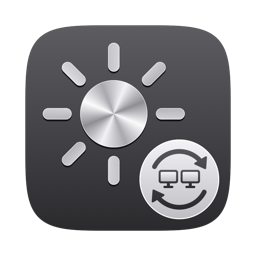

# Brightern



Makes the Tern Setups OLED monitor follow the MacBook's brightness.

Use the brightness keys, the Control Center slider or auto-brightness exactly as before. macOS shows its own brightness indicator and adjusts the MacBook screen, and Brightern copies that level to the monitor over DDC/CI (the standard monitor-control channel over USB-C). Brightern has no brightness UI of its own: just a small sun icon in the menu bar, and a settings window when you open the app.

## Install

```bash
scripts/install.sh
```

Builds with the Swift compiler from the Command Line Tools (no Xcode, nothing downloaded) and installs to `/Applications/Brightern.app`, so it shows up in Launchpad and Spotlight like any other app. If you're moving the project folder, delete `.build` and `build` first: the build cache records absolute paths.

## Using it

Brightern runs in the menu bar. Opening it from Applications, Launchpad or Spotlight shows its settings window, and it appears in the Dock only while that window is open.

**Menu bar**

- **Status line**: e.g. `MacBook 62% → Monitor 62%`
- **Pause Syncing**: the monitor keeps its current level and its own buttons work as usual. Resuming snaps it back to the MacBook's level.
- **Settings…** (⌘,)

**Settings**

- **General**: current levels, turning syncing on or off, Open at login, and Show in menu bar. If you hide the menu bar icon, open the app to get back to settings.
- **Calibration**: the two screens use different technology (LCD and OLED), so the same percentage may not look equally bright. Set the MacBook with the brightness keys, drag the slider until the monitor looks the same, and click **Save This Level**. Do this at a few levels (e.g. dim, medium, bright). Brightern interpolates between the saved levels. **Reset to 1:1** undoes it.
- **About**: version, monitor status and a link to this repository.

## How it works

| Piece | What it does |
| --- | --- |
| `BuiltInDisplay.swift` | Reads the MacBook's brightness (read only; Brightern never changes it). |
| `SyncEngine.swift` | Gets a notification from macOS on every brightness change and works out the monitor level. Re-syncs after sleep, opening the lid, or re-plugging the monitor. |
| `MonitorLink.swift` | Sends DDC commands on a background queue. Merges rapid changes (macOS animates brightness), spaces commands 50 ms apart, and reads the level back after each burst, because the monitor silently drops commands while it's busy. |
| `TernMonitor.swift` | Finds this monitor (EDID vendor 19083 "RTK", product 159) and speaks DDC/CI to it. Other monitors are never touched. |
| `BrightnessCurve.swift` | Maps MacBook level → monitor level; 1:1 until calibrated. |
| `BrighternApp.swift` / `SettingsView.swift` | Menu bar menu and the settings window. New features get a new pane in `SettingsView`. |

It uses two private macOS functions (DisplayServices and IOAVService, the same ones Lunar and MonitorControl use), loaded at runtime. If a macOS update removes them, the menu shows "Not available on this version of macOS" and nothing else is affected. No admin rights, no system files, no special permissions.

## Check it's working

```bash
scripts/check.sh          # brightness-mapping tests
scripts/check.sh --live   # sets the MacBook to 30% and 70%, confirms the monitor follows, then restores
```

## App icon

The icon is drawn in code by `scripts/icon/main.swift` (no image editor needed). After changing the design, run `scripts/make-icon.sh` to regenerate `Resources/AppIcon.icns`.

## Uninstall

```bash
scripts/uninstall.sh
```

Removes the app, its login item and its settings. The monitor keeps its last brightness.

## Version notes

### 1.1 (current)

- Now a proper app: installs to `/Applications` and appears in Launchpad and Spotlight.
- Opening the app shows a settings window (General, Calibration, About) styled like System Settings. Calibration moved there from the menu.
- New setting: Show in menu bar.
- App icon: a machined-metal sun with a sync badge showing two monitors.
- The menu is shorter: status, Pause Syncing, Settings… and Quit.

### 1.0

The first working version, built for one setup: a MacBook Pro (M3 Pro, macOS 26) with a Tern Setups OLED monitor over USB‑C.

- The monitor follows the MacBook's brightness from the brightness keys, the Control Center slider and auto-brightness. Apple's own brightness indicator is unchanged.
- Menu bar icon with a status line, Pause Syncing, Calibrate… and Open at Login.
- Calibration by eye at any number of levels, with interpolation between them.
- Re-syncs after sleep, opening the lid, or re-plugging the monitor.
- Rapid changes are merged, commands are spaced 50 ms apart, and the final level is read back and resent if the monitor dropped it.

Known limitations:

- **Lid closed:** there's no MacBook brightness to follow, so the monitor stays where it was. Planned for a future version.
- **One monitor only:** Brightern only talks to the monitor with EDID vendor 19083 / product 159. Supporting another monitor means changing the IDs in `TernMonitor.swift`.
- **Apple Silicon only:** the DDC path uses the Apple Silicon display service (IOAVService); Intel Macs aren't supported.
